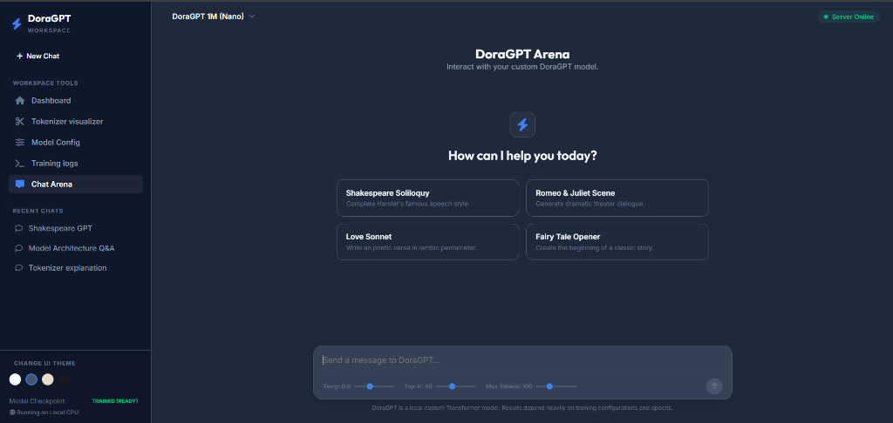
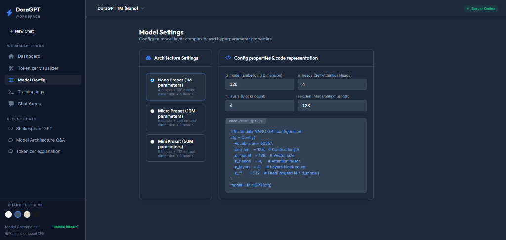

# 🧠 DoraGPT — Laptop Edition

A lightweight, beginner-friendly causal Transformer language model written from scratch in PyTorch, paired with a modern web dashboard designed in the style of ChatGPT/Claude. Runs entirely on local CPU, requiring less than 500 MB RAM.

---

## 📸 Application Screenshots

### 1. DoraGPT Chat Arena


### 2. Model Settings & Configuration


---

## 🛠️ Features

- **BPE Tokenizer Visualizer**: Visualizes Byte-Pair Encoding splits and maps text characters to color-coded token IDs dynamically.
- **Architecture Configuration**: Customize parameters between **Nano (1M params)**, **Micro (10M params)**, or **Mini (50M params)** presets.
- **Live CPU Training Monitor**: Train the model on the tiny Shakespeare dataset in your browser with real-time Chart.js loss graphs, logs, and play/pause controls.
- **GPT/Claude Chat Playground**: Chat with the trained model or use the untrained fallback. Supports temperature and Top-K controls.
- **Modern Switchable Themes**: Toggle between White (Light), Grey (Slate), Yellow (Warm Beige), and Black (OLED) color layouts.

---

## 🚀 How to Run

1. **Setup Environment**:

   ```bash
   python -m venv venv
   # Activate on Windows:
   venv\Scripts\activate
   # Activate on Linux/Mac:
   source venv/bin/activate
   ```

2. **Install Dependencies**:

   ```bash
   # Install PyTorch CPU first (lighter download size)
   pip install torch --index-url https://download.pytorch.org/whl/cpu
   # Install other dependencies
   pip install -r requirements.txt
   ```

3. **Start the Web Server**:
   ```bash
   python web_server.py
   ```
   Open your browser and navigate to **[http://127.0.0.1:8000](http://127.0.0.1:8000)**!
